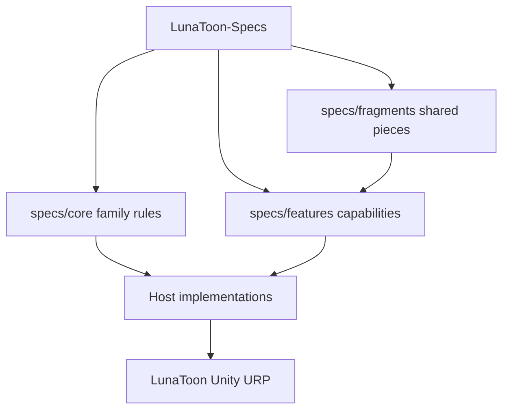

# LunaToon Architecture

Cross-host layering guide for LunaToon. Normative field rules live in
[specs/](specs/core/lunatoon-conformance.md); this note defines ownership boundaries.

## Goals

- Keep a portable shading and material contract that Unity (and future hosts) can implement.
- Separate normative behavior from engine-specific shader code, inspectors, and packaging.
- Allow draft iteration without pretending a released standard exists yet.

## Layers

| Layer | Owns | Does not own |
|-------|------|--------------|
| `specs/core/` | Family rules: naming, `specVersion`, requirement voice, URP baseline | Pass lists, C#, Shader Graph assets |
| `specs/features/` | One capability per file (outline, shade, rim, …) | Host UI layout, package SemVer |
| `specs/fragments/` | Shared property/schema pieces reused by features | Standalone shipping features |
| `decisions/` | ADRs that lock product direction | Runtime code |
| `implementations/` | Per-host capability notes and pins | Normative schema |
| Code repos (e.g. LunaToon) | Shaders, C#, samples, CHANGELOG, UPM | Portable MUST/SHOULD/MAY contracts |

## Specs vs code

| Content | LunaToon-Specs | LunaToon (Unity) |
|---------|----------------|------------------|
| Property names, defaults, units, version bounds | Yes | Implements |
| Lighting / outline / rim behavior contracts | Yes | Implements |
| ADRs and host profiles | Yes | May link from README/docs |
| HLSL, Shader Graph, materials, Editor UI | No | Yes |
| Package SemVer / CHANGELOG | No | Yes |

Cross-links use GitHub URLs. Do not submodule this vault into the Unity project.

## Host map

| Host | Profile | Notes |
|------|---------|-------|
| Unity 6 URP | [lunatoon-unity.md](implementations/lunatoon-unity.md) | Primary implementation; PC + Mobile renderer assets |

## Open questions

- Feature set for the first shading pass (outline, shade steps, rim, specular, matcap) — TBD.
- Shader Graph vs handwritten HLSL ownership — TBD (record in `decisions/` when chosen).
- UPM package split inside LunaToon vs monorepo host — TBD.
