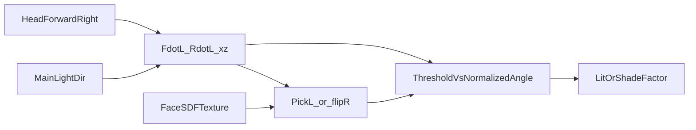

# Anime face SDF

Non-normative research note on head-space SDF face shadow maps (miHoYo /
Genshin-style). Property identifiers, MUST/SHOULD rules, and host requirements
belong in a future `specs/features/` draft if the capability is adopted.

## Purpose

Document how public anime face SDF techniques work so a later shade or
face-shading feature can be drafted without rediscovering the math. Normative
rules stay in [conformance](../specs/core/lunatoon-conformance.md) and feature
specs when written.

## Problem

Mesh N·L on stylized faces produces blotchy nose and cheek lighting. Artists
want a painted soft shadow shape that follows head orientation versus the main
light, independent of facial mesh normals.

## Core idea

Bake a greyscale SDF (or an SDF merge of hand-painted angle maps) into a face
UV texture. At runtime, evaluate the main light in **head local xz** using head
forward and right vectors. Pick the left map or a mirrored right sample from
`RdotL`. Compare a normalized `FdotL` against the sampled SDF value to get a
lit-or-shade factor.

### Typical runtime steps (non-normative)

Public demos (see [Provenance](#provenance-research)) converge on a pattern like:

1. Optional yaw offset: rotate light around world up before dots.
2. `Forward` / `Right` from head or object basis (often world-matrix columns;
   upright correction sometimes applied).
3. `FdotL = dot(Forward.xz, L.xz)`, `RdotL = dot(Right.xz, L.xz)`.
4. Sample SDF: if `RdotL > 0` use right (or flipped) channel/map, else left.
5. Normalize forward alignment into roughly `[0, 1]`, e.g.
   `(-FdotL + 1) * 0.5`.
6. Hard or soft compare: `step(normalizedFdotL, sdfSample)` or a soft edge /
   ramp around that threshold.
7. Use the result as the face lit/shade mask; skip or replace N·L cel shade on
   that material.

Exact saturate order, soft-edge width, and composite with shade color are
implementation choices in those demos, not LunaToon decisions.

## Authoring pipeline

Common offline workflow:

1. UV-unwrap the face (existing UV or a dedicated channel).
2. Paint several greyscale shadow shapes for light angles on one side of the
   face (often on the order of ~9 angles spanning 0°–180° on the xz plane).
3. Convert each painted mask to an SDF, then merge into one texture that
   encodes shadow coverage versus angle.
4. Import as linear / non-sRGB (directional-lightmap style), not color sRGB.

Some tools flip or mirror for the opposite light side at runtime so artists only
author one side.

## Runtime inputs

| Role | Typical source | Notes |
|------|----------------|-------|
| Face SDF texture | Material texture slot | Greyscale; linear import |
| Head forward / right | Object transform columns, or script-fed head bone | Wrong basis → shadow ignores head turn |
| Main light direction | Pipeline main directional light | Most writeups assume one primary light |
| Yaw offset | Optional scalar | Fixes model-forward mismatch |
| Soft edge / ramp | Optional | Hard `step` vs soft threshold / ramp tex |

## Contrast with MToon shading shift

MToon 1.0 `shadingShiftTexture` offsets the N·L toon threshold per UV. It stays
in mesh-normal lighting space. Head-space SDF replaces that path for faces: the
lit/shade decision comes from head-vs-light angle and a baked map, not from
shifted N·L.

MToon 0.x `_ShadingGradeTexture` multiplies light intensity before the ramp
(UTS2 ShadingGradeMap-style). Also UV-driven and N·L-based.

| Approach | Space | What the texture does |
|----------|-------|------------------------|
| Head-space face SDF | Head xz vs light | Threshold / coverage vs angle |
| MToon 1.0 `shadingShiftTexture` | Mesh N·L | Additive boundary shift |
| MToon 0.x ShadingGrade | Mesh N·L | Multiplicative grade before ramp |

A future LunaToon ↔ MToon role map may note lossy fallback only. Those texture
slots are different contracts.

## Host caveats

- **Head basis:** Skinned face mesh root may not match head bone forward. Demos
  that read `unity_ObjectToWorld` fail when the head mesh root is wrong; a
  companion script that pushes head-bone axes is a common fix.
- **Additional lights:** Public samples focus on one directional light.
  Multi-light policy is undefined here.
- **Receive shadows:** Engine shadow maps on faces often look dirty; some demos
  offset receive-shadow sampling or reduce receive amount on face materials.
- **BIRP / URP:** Math is pipeline-agnostic; light and transform plumbing is not.
  Parity belongs in a later implementation profile if the feature ships.

## Open questions for a future feature spec

Leave these undecided until a `specs/features/` draft exists:

- Separate feature vs a shade-mode enum on a general shade spec
- Property identifiers, defaults, ranges
- Hard `step` vs soft edge / ramp composite
- GI, receive shadows, and additional lights
- Bake-tool ownership (DCC addon vs Unity Editor utility vs external)
- Whether / how face SDF SHOULD map to MToon shift or grade textures
- Required head-basis API (material-only vs host component)

## Provenance (research)

Third-party writeups and sample shaders. **Not** LunaToon normative text.

| Source | What it covers |
|--------|----------------|
| [URP Genshin Face Shader Test](https://noirccc.net/blog/posts/33) (NoiRC) | Early SDF lightmap + `FdotL` / `RdotL` compare |
| [Genshin Face Shader demo workflow](https://noirccc.net/blog/posts/54) (NoiRC) | Simplified L/R pick; 0°–180° coverage note |
| [URPSimpleGenshinShaders](https://github.com/NoiRC256/URPSimpleGenshinShaders) | Sample HLSL: face shadow map, yaw offset, upright fix |
| [AnimeShadingPlus face shadow bake](https://github.com/EricHu33/AnimeShadingPlus-Anime-Toon-Shader/blob/main/Anime%20Shading%20Plus(+)%20User%20Manual%20e9875988ae1e41caa5198370d9cc963d/Face%20Shadow%20Map-%20Creation%20%26%20Baking%20Workflow%20d3b8769021e04683a2f2ae4cf16ac810.md) | Paint angle masks → SDF generate/merge |

## Related

- [LunaToon Architecture](../architecture.md)
- [LunaToon Conformance](../specs/core/lunatoon-conformance.md) (MToon mappability family rule)
- [LunaToon Rim](../specs/features/rim.md) (skeleton; unrelated to face SDF)
- [LunaToon Unity](../implementations/lunatoon-unity.md)
